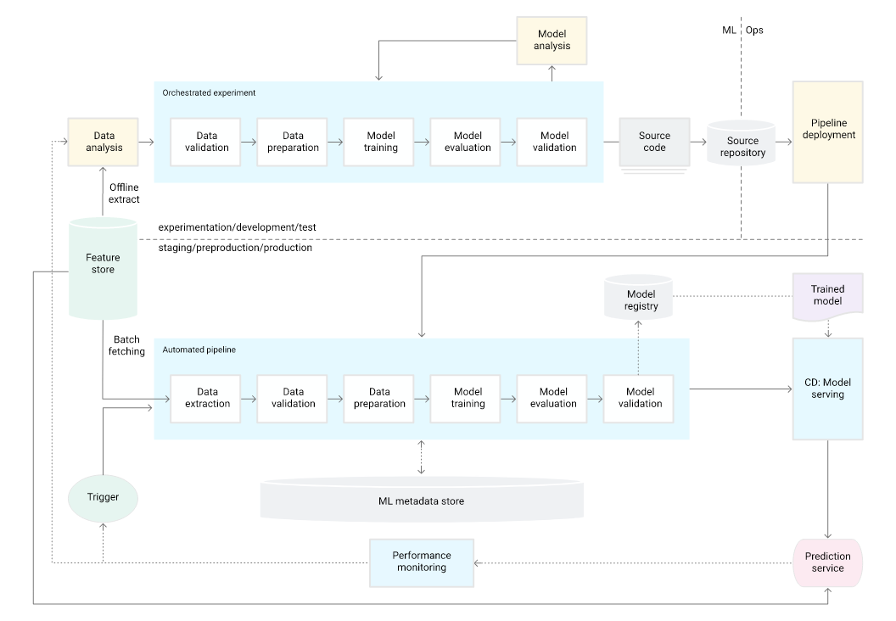

# Network Reconstruction:

<<<<<<< HEAD
## Contributors
- Yi Yao Tan (MFoCS University of Oxford)- Network Geometry and Analysis


## Goal

=======

## Contributors
- Yi Yao Tan (MFoCS University of Oxford)- Network Geometry and Analysis

## Goal

Two main tasks:
1) Network to Manifold Embedding
2) Manifold to Network (Random Statistical Ensemble Generation)

>>>>>>> 826789ae35517c3915770cc666ce374923ae8c04
Hopefully this will become a larger project in network reconstruction studying input-output networks.

## Contact 

Main admin: Yi Yao Tan

[LinkedIn](https://www.linkedin.com/in/yi-yao-tan-9719301a3/)

[Email](mailto:yytanacademic@gmail.com)

## Initial Setup:

Running `.\scripts\setup\setup.sh` will create conda environment and create and download requirements (run from network_reconstruction root, eg. same folder as this readme)
pyvis only compatible with python 3.10. Also works when you are missing dependencies and want to update the environment it will ask to create new conda env or use old env.

## Organization
Consists of four main branches:

## Network Geometry Package: ```\network-geometry```

This has a separate readme and autogenerated documentation within. Mainly used to do network geometry tasks such as embedding and random generation

## Network Analysis Package: ```\network-analysis```

This has a separate readme and autogenerated documentation within. Mainly used to do network analysis tasks such as distribution analysis, reciprocity, analyse real world data.

## Orchestrated Experiment Development Branch: ```\dev```

Development branch for functions, classes for visualizers and algorithms and notebooks to study input-output networks and other network data.


##  Data For Experiments ```\data``` 

Real world data such as input-output-networks and other weighted, directed networks.

## Development:

We develop in the same way as in spirit of MLOPs where orchestrated experiments are in the ```\experiments``` folder and automation in packages.


## Package Creation/ Export found in `network_reconstruction\scripts\package-generation`:

In case more packages need to be created two scripts have been provided, documentation are auto compiled with package `sphinx`

### Package setup: `setup_file_tree.sh` 

Creates a generic file tree for a package.

### Package creation: `create_package.sh` 

Builds folder into package.

###  Documentation creation:

Using `sphinx` package

1) Install: 
```bash
pip install sphinx
```

2) Start:
```bash
sphinx-quickstart
```

3) Update `conf.py` file: 
```python
import os
import sys
sys.path.insert(0, os.path.abspath('../../my_package'))
```

4) Create documentation:
```bash
sphinx-apidoc -o source/ ../my_package
```

5) Build documentation:
```bash
make html
``` 

## Structure of packages:

We give `network-geometry` as an example, same applies for `network-analysis`

`network-geometry` is a Python package designed to handle network geometry data. This package provides various utilities, modules, and submodules to simplify the processing and analysis of such data.
Implemented linearized and tensorized in JAX. This document is an initial contributing guide.

## File Tree

Below is the file tree structure of the `network-geometry` package:

```
network-geometry/
├── network-geometry/
│   ├── __init__.py
│   ├── standard/
│   │   ├── __init__.py
│   │   ├── module1.py
│   │   ├── module2.py
│   │   └── ...
│   ├── JAX/
│   │   ├── __init__.py
│   │   ├── module1.py
│   │   ├── module2.py
│   │   └── ...
│   ├── utils/
│   │   ├── __init__.py
│   │   ├── helpers.py
│   │   ├── math_ops.py
│   │   └── ...
│   ├── data/
│   │   ├── __init__.py
│   │   ├── data_loader.py
│   │   └── ...
│   └── examples/
│       ├── __init__.py
│       ├── example1.py
│       ├── example2.py
│       └── ...
├── docs/
│   ├── conf.py
│   ├── index.rst
│   ├── make.bat
│   ├── Makefile
│   └── source/
│       ├── modules.rst
│       ├── linearized.rst
│       ├── tensorized.rst
│       └── ...
├── tests/
│   ├── __init__.py
│   ├── test_standard.py
│   ├── test_jax.py
│   └── ...
├── scripts/
│   ├── setup.py
│   ├── requirements.txt
│   ├── README.md
│   ├── LICENSE
│   └── ...
└── .gitignore

```


## Installation

To install the `network-geometry` package, use the following command:

```bash
pip install network_geometry
```

## Usage

Here's a quick guide on how to use the network_geo package.

### Importing Modules

You can import and use functions or classes from the package as follows:

```python
from network_geo.submodule1.module1 import function_in_module1
from network_geo.submodule1.sub_submodule1.sub_module1 import function_in_sub_module1
from network_geo.submodule2.module2 import function_in_module2
from network_geo.utils.helpers import helper_function

# Example usage
result1 = function_in_module1()
result2 = function_in_sub_module1()
result3 = function_in_module2()
helper_result = helper_function()
```
### Running Tests

To run the tests for the package, you can use the unittest framework:

```bash
python -m unittest discover -s tests
```

## Contributing

Please ask Yi Yao Tan (yao-creative) before contributing. If you'd like to contribute to network_geo, please follow these steps:

    1) Fork the repository.
    2) Create a new branch (git checkout -b feature-branch).
    3) Make your changes.
    4) Commit your changes (git commit -m 'Add new feature').
    5) Push to the branch (git push origin feature-branch).
    6) Open a pull request.

NOTE: PLEASE PROVIDE DOC STRINGS AND TYPE ALL OF THE FUNCTIONS, PERFORM ERROR HANDLING TO THE BEST OF YOUR ABILITY 

### Example of well written function

```python
from typing import List

def calculate_average(numbers: List[float]) -> float:
    """
    Calculate the average of a list of numbers.

    Args:
        numbers (List[float]): A list containing numeric values.

    Returns:
        float: The average value of the numbers.

    Raises:
        ValueError: If the input list `numbers` is empty.

    Example:
        >>> calculate_average([1, 2, 3, 4, 5])
        3.0
    """
    if not numbers:
        raise ValueError("Input list cannot be empty")

    return sum(numbers) / len(numbers)
  
```

### Init files

#### `__init__.py`

```python
# network_geo/submodule1/__init__.py

# Import specific functions/classes for submodule1
from .module1 import function_in_module1
from .sub_submodule1.sub_module1 import function_in_sub_module1

# Optionally define what gets imported when someone imports the submodule
__all__ = [
    'function_in_module1',
    'function_in_sub_module1',
]

# Optional initialization code
print(f"Initializing submodule1: {__name__}")

# You can also define variables or perform other setup tasks here
# For example:
# VERSION = '1.0'

# End of __init__.py
```

### File Contents for Example Functions

Here are some example functions you can use to populate the modules and submodules:

#### `module1.py`

```python
def function_in_module1():
    return "Function in module1"
```
#### `sub_module1.py`

```python
def function_in_sub_module1():
    return "Function in sub_submodule1"
```

#### `helpers.py`

```python
def helper_function():
    return "Helper function"
```


### Example Test Files

#### `test_module1.py`

```python
import unittest
from network_geo.submodule1.module1 import function_in_module1

class TestModule1(unittest.TestCase):
    def test_function_in_module1(self):
        self.assertEqual(function_in_module1(), "Function in module1")

if __name__ == '__main__':
    unittest.main()
```

#### `test_sub_module1.py`

```python
import unittest
from network_geo.submodule1.sub_submodule1.sub_module1 import function_in_sub_module1

class TestSubModule1(unittest.TestCase):
    def test_function_in_sub_module1(self):
        self.assertEqual(function_in_sub_module1(), "Function in sub_submodule1")

if __name__ == '__main__':
    unittest.main()
```

####  `test_helpers.py`

```python
import unittest
from network_geo.utils.helpers import helper_function

class TestHelpers(unittest.TestCase):
    def test_helper_function(self):
        self.assertEqual(helper_function(), "Helper function")

if __name__ == '__main__':
    unittest.main()
```


## License
This project is licensed under the MIT License. See the LICENSE file for details.

z